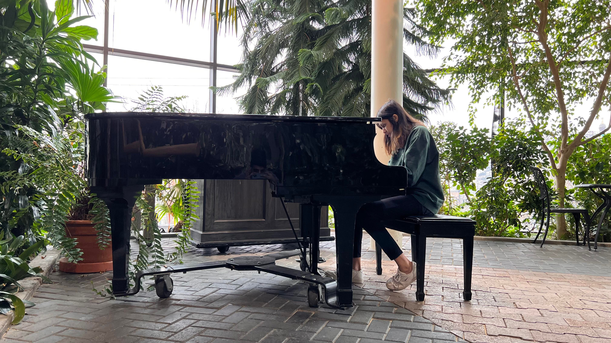
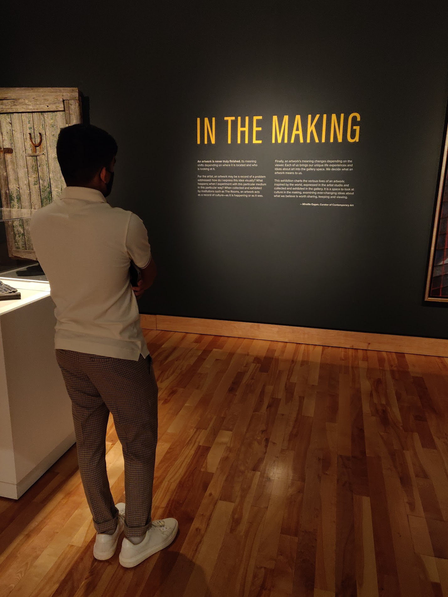
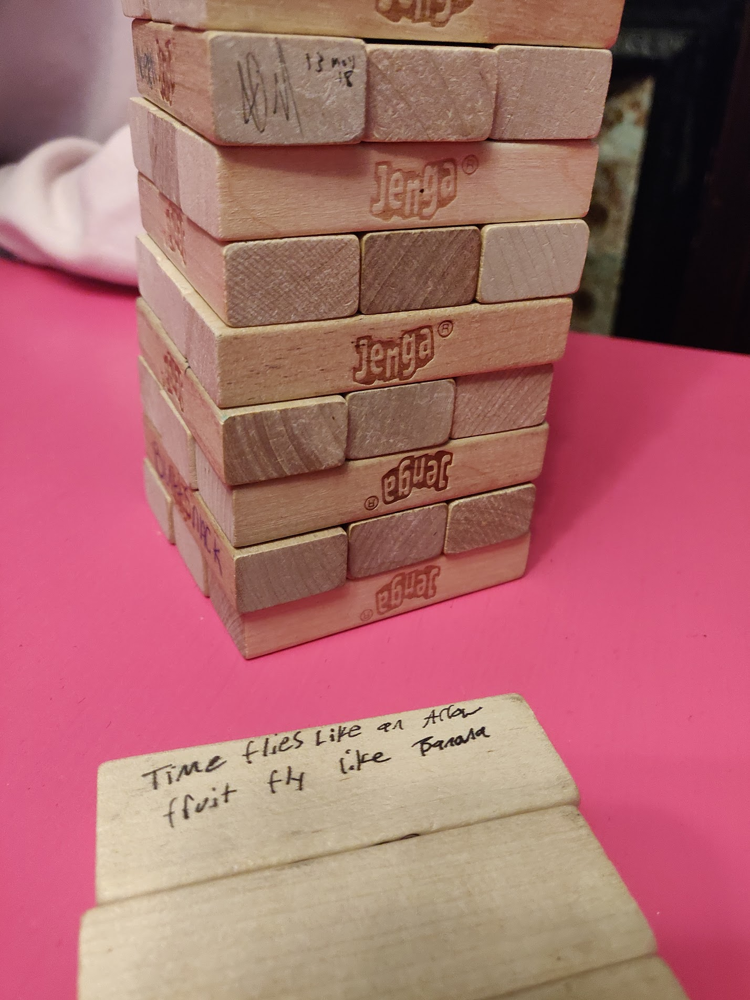
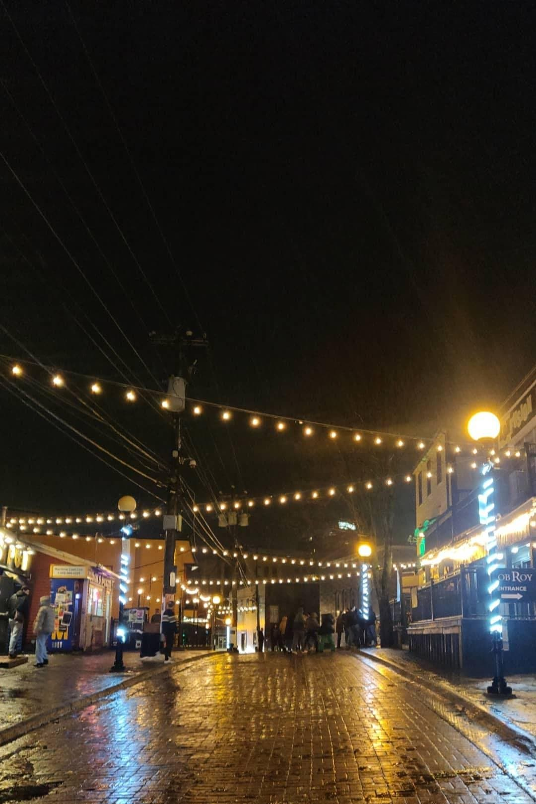
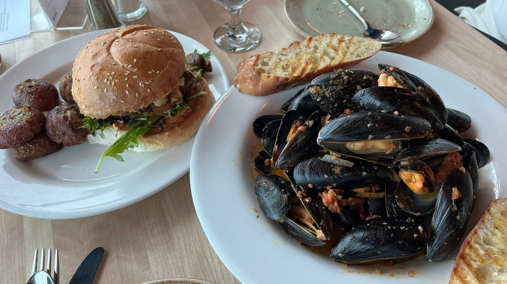
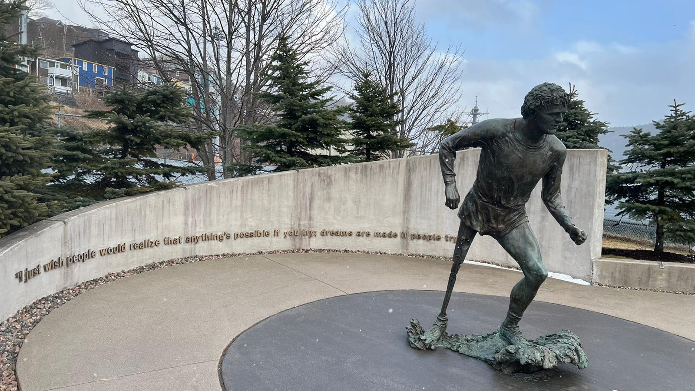

   

## Outside In
[Sheraton Hotel](https://goo.gl/maps/89ejmnScLAi6nxQy9)

I once read the description of a Japanese architect’s project which was designed for a married couple and their cat(s). He intended for the humans and cats to live in the same home, rather than the cats living in the humans’ home. 

Anyway, home is how I felt when I sat in front of the piano in the Sheraton outside-in garden. This home replaced the feelings of self-doubt, pressure and distance that I harbored since I graduated from high school and left behind its cozy, out-of-tune grand piano.

For the first time in a while, I heard the emotions emanating from the piece itself; all I had to do was play the notes out loud, soft, slow, fast, pedal. It transported me to the days of competition, low-key concerts and choir accompaniment, when there was no room to be conscious in the world between my piano and me. The camera, the person I played for, my self-awareness were all in another world, observing me.

The outside has always done this for me: created a space of calm, wonder and imagination; a space which I can call home, where I can be a child again.

<em>We chased each other, over and under the staircase rails. I climbed on his shoulders. He made me fly. We danced.</em>

   

## Leela: In the making
[The Rooms](https://goo.gl/maps/YbmUPZdXaawqmhSF9)

One of the first things I admired about you was your ambition to become a professional artist. Quickly, I realized there was something about you that was even more admirable: your versatility. Not just as a person who seeks to be an ever-changing being, but also as an artist who wants to perform vastly different roles/fronts.

We walked around this floor, reading about pieces that remain unfinished and painters who refuse to be just painters (because we are gardeners, photographers, brothers, tailors, athletes,... all at once). With each room we visited, you, the artist, kept circling in my thoughts.

In your self-tapes and spontaneous impersonations, I can’t tell that it’s <em>You</em>. I think that is just incredible. In your career and in the art you will perform, I hope you will continue to remain in the making. I hope your versatility keeps growing, your artistry ever-changing and for each artwork to cause you a little discomfort.  

   

## Camaraderie
[The Geek Pub](https://g.page/geekspub?share)

You know how in the movies, in a dim-lit, busy tavern, there’s always people telling other people stories? Plenty of laughter and cheers going around. The Geek Pub felt like such a scene from a movie.

On the first floor, the bartender with his hearty voice, narrating stories of St. John’s - the tragic reason behind their hospitality being their historical isolation from the rest of Newfoundland and Canada. On the second floor, friends setting up shop to live stream their video games. Everyone seems to know each other, and me too, but it’s my first time here.

Really, wherever we went, I didn’t feel like I was living <em>in</em> the eastern-most city of Canada. I was living <em>with</em> it. This is what I will remember St John’s for.

<em>
“Is ye a screecher?”

“Indeed I is, me old cock. Long may your big jib draw!”
</em>

   

## The women in the pubs
[George Street](https://goo.gl/maps/vidWKPDb8uVcwTA68)

We first stumbled upon George Street during our evening walk downtown. The somewhat hidden staircase was aesthetic, but the street it opened up to was unrevealing. Only later we found out that this was the longest street in Canada of pubs/bars.

St John's is largely an Irish settlement; we decided to go bar hopping on St. Patrick's weekend. In other provinces, this holiday is basically an excuse to drink and party. Here, we found local musicians, Irish folk songs, and an older population crowding the dance floors.

Each pub wore its own personality: 

At Greensleeves, we stood next to two seated older women. As they were leaving, they told us to "grab these seats quick, or someone else will nab them." Once we were seated, the only brown people in the pub (except one of the bouncers), a woman tapped me on the shoulder. "Don't let any white man be rude to you here. They can be racist, but don't you take it from them. I've got your back."

I asked her for recommendations on where to go next. We crossed the street to the Martini Bar together. There, I danced hard, and then I danced with women I didn't know. One of them mouthed "Help" to me. I pulled her away and we stuck close to each other, still dancing.

A guest singer - female - took to the stage. I watched her be in her own world, exchanging smiles with the only other people in her world (the band). She wore a black baseball cap backwards and a black tank top. Her voice was deep and powerful. Later, I ran into her in the washroom and complimented her. "Awh thank you," she said, in an unexpectedly sweet voice.

At the last pub, there were mostly just women dancing, in pairs.

   

## The winds and the food
[Moo Moo's](https://goo.gl/maps/RTtDaSAjkZGxFXiUA)

St John's is bordered by the Atlantic Ocean. One of its traditional activities is fishing, just like my hometown Mombasa. Unlike the humid equatorial city, St John's is infamous for its winds. Twice in a week, the city experienced wind storms, with wind speeds up to 60kmph. 

Residents were warned to remove any loose objects from their curbs, flights were unable to land, taking off again to land in Halifax, parked cars were swaying, and we ran in swirls around the top of Signal Hill, with a foggy view of the entire city and the ocean during sunset.

The wind bites at you and surges you forward, it's exhilarating. We got a waffle cone with a scoop of Tornado topped with a scoop of Turtle Cheesecake from Moo Moo's - the local ice cream shop that high school kids, including Michael, used to bring their packed lunches to. 

When the hail, which is mild by itself, starts to follow the wind currents, it's as if the snow is speeding directly towards you, only to whip away at the last moment. It was particularly calm outside when I tried the city's fish: steamed mussels, codfish and swordfish. None of which I had tried back home from the Indian Ocean.

   

## Terry Fox
[The Terry Fox Memorial](https://goo.gl/maps/ZHdx2qR8x3BTm7vW9)

He dipped his amputated leg in the Atlantic Ocean and began his Marathon of Hope from St John's. His destination was the Pacific Ocean at Victoria, BC, but he was only able to make it until Thunder Bay, Ontario. 

The cancer had returned and eventually took his life.

   

## Innuit Soundings
[The Rooms](https://goo.gl/maps/YbmUPZdXaawqmhSF9)

We gathered around the fire to listen to Tania Williard's stories, which were mostly about the fire too. This was my first storytelling experience with an indegeneous people; I felt humbled and honored. She taught us a simple throat song. She sang songs while playing on her drum.

The drum, the call-and-response of the song, the storytelling, the fire. I was surprised that each of these was part of my cultural history too. Part of Kenya's too. I wondered if gatherings like these are what we lose when we globalise.

Afterwards, we were led inside to listen to Deantha Edmunds, the only Innuit soprano opera singer in Canada. She walked into the room and took her place next to an abstract painting of a sheet music, words scattered around a staff that had no defined bars. 

She interpreted this artwork about indegenous land grabbing, in languages I didn't understand, but whose emotions I felt. I teared up as the tree which provided shade under which elders told stories fell to the ground.

<figure class="video_container">
  <video controls="true" preload="metadata" allowfullscreen="true">
    <source src="../assets/throat_singing.mp4#t=0.1" type="video/mp4">
  </video>
  <figcaption>Throat Singing Lesson</figcaption>
</figure>

   

## Full List of Things/Places
- Sheraton Hotel
- Walking around downtown
- Underground Snax: inventory of special editions of popular snacks
- Bad Bones Ramen: you might want to ask for less salt, the pork noodles are bomb
- Avalon Mall: St. John’s only mall, a classic
- The Geek Pub (Geek’s Public House): board games / video games, drinks
- The Rooms: museum / art gallery / restaurant
- Anglican Cathedral, Basilica Cathedral (but both were closed)
- The Convention Center
- Moo Moo’s: the best ice cream you will ever have
- Quidi Vidi: lake, brewery, plantation boutique
- Belbin’s: cute grocery store with local products
- Cape Spear: easternmost point in North America
- Mallard Cottage: upscale dining
- George Street: longest street in Canada of bars/pubs
- nlSpicebox: “the most authentic dosa place in Canada” -Samad
- Rocky Mountain Chocolate Factory
- The Terry Fox Monument
- Signal Hill: eagle’s eye view of the city and ocean

<em>Shoutout to our hosts: Samad & Michael, hope to see you soon!</em>

